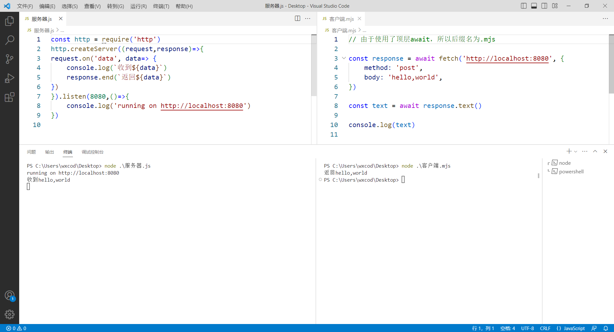

# 简单的服务器-客户端示例

下面是一个最简单的HTTP-客户端服务器示例，这个例子中，我们使用fetch API以便可以在命令行发送请求。

Fetch API是取代XMLHttpRequest的新兴JavaScript 网络请求API，使用方便，结构清晰，不再推荐使用XMLHttpRequest。

## 服务器代码

```js
// 服务器.js

const http = require('http')
http.createServer((request,response)=>{
request.on('data', data=> {
    console.log(`收到${data}`)
    response.end(`返回${data}`)
})
}).listen(8080,()=>{
    console.log('running on http://localhost:8080')
})
```

然后运行`node 服务器.js`就运行了一个服务器。

这个例子中，当有请求发给服务器时，服务器首先在自己的终端输出“收到”加上请求报文的body文本。然后在body文本前面加上“返回”返回给客户端。

实际的情况肯定比这复杂，但是万变不离其宗，只要这个最小示例掌握了，那么再处理更复杂的HTTP请求就不再话下了。

## 客户端代码

```js
// 客户端.mjs
// 由于使用了顶层await，所以后缀名为.mjs

const response = await fetch('http://localhost:8080', {
    method: 'post',
    body: 'hello,world',
})

const text = await response.text()

console.log(text)
```

然后运行`node 客户端.js`，此时会发送一个post请求，请求报文的正文是“hello,world”文本，根据我们设定的服务器处理方式，我们会得到一个服务器返回的数据，内容是“返回hello,world”。

笔者在VSCode中编写、运行的效果如下：



