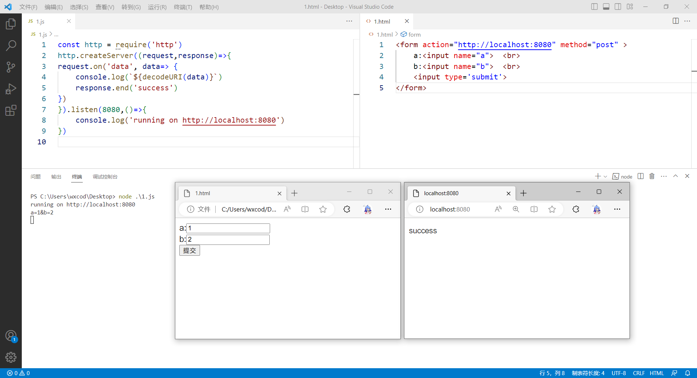

# 简单的表单提交与接收示例

对于HTTP协议，最常用的例子就是表单提交。下面是一个简单的客户端表单提交、服务器接收的示例。

## 服务器代码

复制下面的代码然后保存到文件如1.js。

```js
const http = require('http')
http.createServer((request,response)=>{
request.on('data', data=> {
    console.log(`${decodeURI(data)}`)
    response.end('success')
})
}).listen(8080,()=>{
    console.log('running on http://localhost:8080')
})

```

然后运行`node 1.js`，就启动了一个HTTP服务器。

这个示例中，当接收到客户端发送过来的数据时，在控制台输出解码后的数据。然后将“success”文本返回给客户端。

## 客户端代码

复制下面的代码保存到文件如1.html。

```html
<form action="http://localhost:8080" method="post" >
        a:<input name="a">  <br>
        b:<input name="b">  <br>
        <input type='submit'>
</form>
```

然后双击1.html以使用Edge打开该文件，分别在两个文本框中输入值，这里我们输入1和2，然后点击提交，就会立即看到“success”。回到nodejs的命令行，也看到终端输出了a=1&b=2。

至此一个简单的浏览器-服务器示例运行成功。笔者使用VSCode和Edge运行的截图如下：



